# Clapback

**Clap once in a room. Clapback tells you why it sounds the way it does and
what to change.**

Clapback is a room-acoustics app for a phone. You say what the room is for,
give its size, tap what it's made of, and measure it: with a hand clap for a
quick answer, or with a test sweep from a speaker for an accurate one. It
reports the reverberation time against the target from the standards, draws
the charts an acoustician would look at, maps speech clarity and bass over
the floor in 3D, and plans a treatment that fits your budget.

**Live app:** https://clapback-alpha.vercel.app (installable on Android and
desktop; open it on a phone for the microphone and camera features).

Built for the [Nebius x NVIDIA Global AI Hackathon](https://nebiusglobalaihackathon.devpost.com/).
The language model is **NVIDIA Nemotron 3 Super** on **Nebius Token
Factory**, and it never produces an acoustic number (see [The rule](#the-rule)).

<p align="center">
  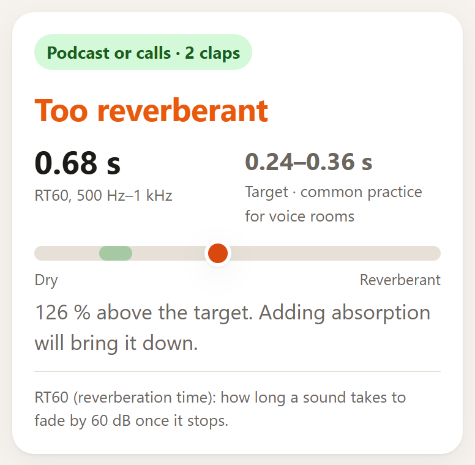
  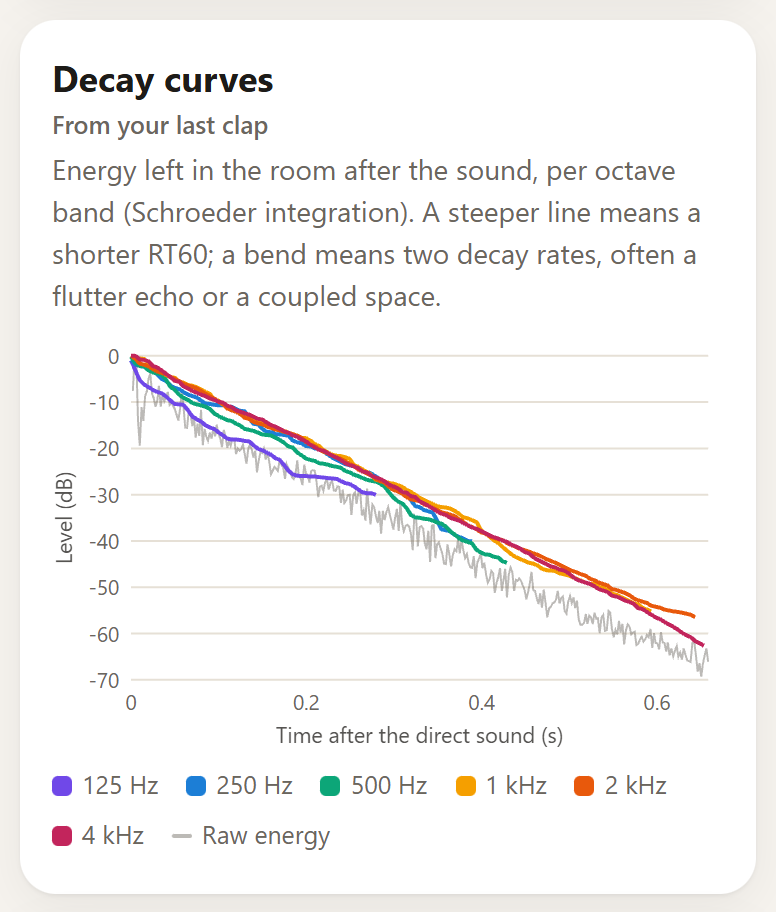
  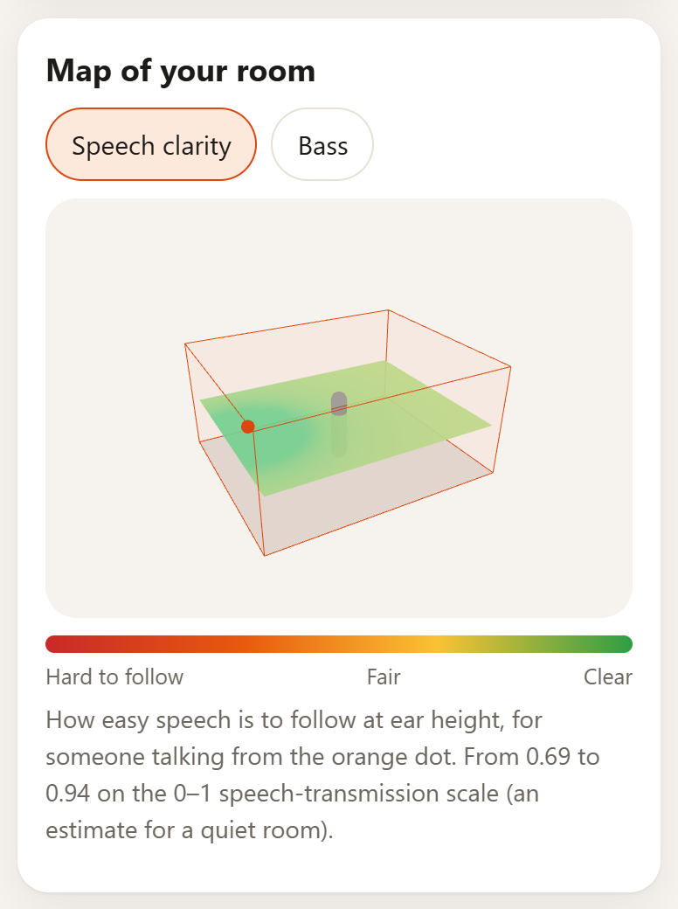
</p>

## Contents

- [What it does](#what-it-does)
- [The results, chart by chart](#the-results-chart-by-chart)
- [How it works](#how-it-works)
  - [The rule](#the-rule)
  - [Measuring: clap or sweep](#measuring-clap-or-sweep)
  - [From a recording to decay curves](#from-a-recording-to-decay-curves)
  - [ISO 3382-1 values](#iso-3382-1-values)
  - [Room model and calibration](#room-model-and-calibration)
  - [Room modes, maps and targets](#room-modes-maps-and-targets)
  - [Treatment plans](#treatment-plans)
  - [Measuring the room with the camera](#measuring-the-room-with-the-camera)
- [NVIDIA Nemotron on Nebius Token Factory](#nvidia-nemotron-on-nebius-token-factory)
- [Accuracy and tests](#accuracy-and-tests)
- [Limits](#limits)
- [Using the live app](#using-the-live-app)
- [Running it yourself](#running-it-yourself)
- [API](#api)
- [Project layout](#project-layout)
- [References](#references)
- [License](#license)

## What it does

Five short steps, one task per screen:

1. **Use.** Podcast or calls, playing music, mixing, studying or teaching,
   movies, or just curious. This sets the target.
2. **Size.** Presets and steppers, measured with the phone camera (any
   phone), or an AR scan of the floor corners (phones with ARCore).
3. **Materials.** Floor, walls, ceiling, how furnished it is, windows, plus
   free text ("a double bed and a big bookshelf") that Nemotron turns into
   absorbers from the materials table.
4. **Measure.** A clap (just the phone) or a 6-second test sweep played by a
   speaker 2 m away.
5. **Results.** Verdict, charts, maps, ISO values, and a budgeted plan.

<p align="center">
  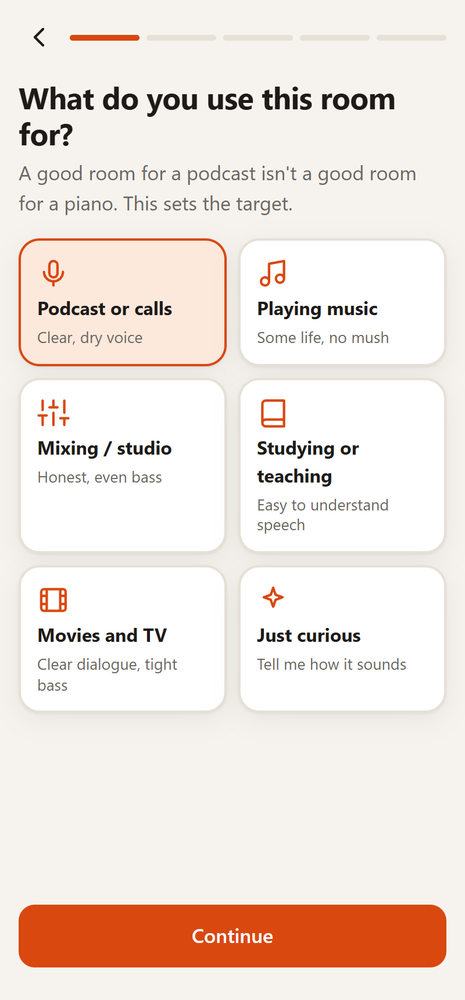
  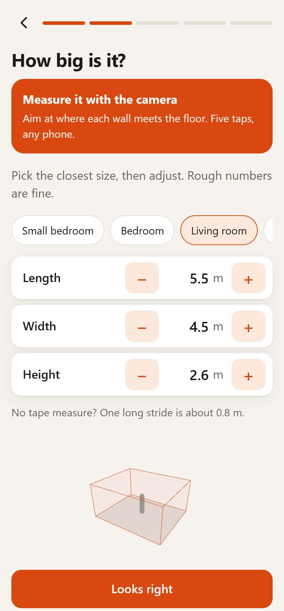
  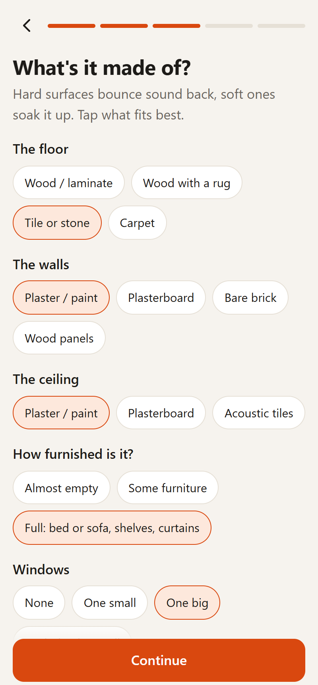
  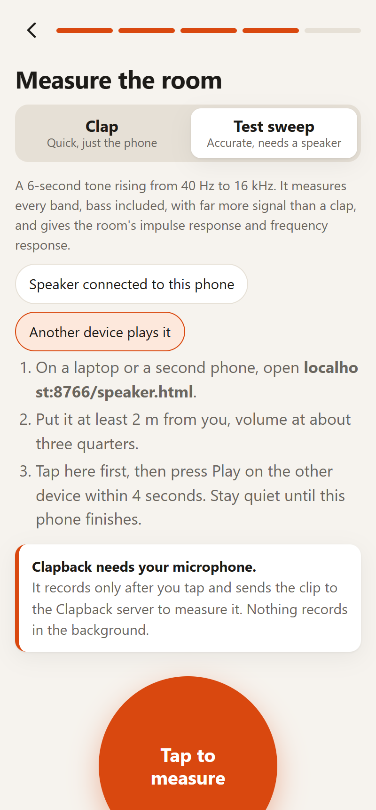
</p>

## The results, chart by chart

The screenshots in this section come from two real claps recorded with an
Android phone in a furnished living room, sized with the app's "Living room"
preset (5.5 × 4.5 × 2.6 m), and analysed for "Podcast or calls". The two
charts marked *synthetic* come from a sweep through the synthetic test room
in `tests/test_sweep.py`, because those charts need a sweep.

### Verdict and key figures


The headline compares the **mid-frequency reverberation time** (RT60, the
mean of the 500 Hz and 1 kHz octave bands) with the target range for the
chosen use: *Within target*, *Too reverberant* or *Too dry*. The card names
the standard the target comes from and defines RT60 in one line: the time a
sound takes to fade by 60 dB once it stops.

Below it: C50 (speech clarity), D50 (definition), the room volume, the
Schroeder frequency (below it the room behaves as separate resonances) and,
with several measurements, how well they agree.

<br clear="right">

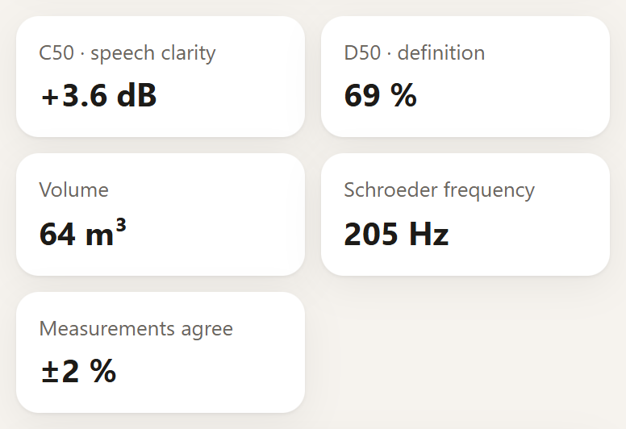

### RT60 per octave band

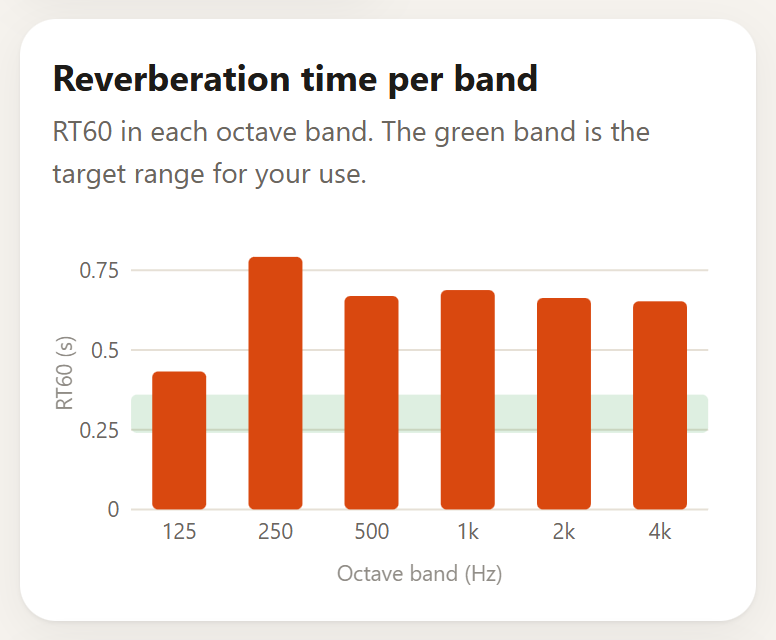

RT60 in each octave band from 125 Hz to 4 kHz, with the target range shaded.
Low bands from a single clap are drawn faded: a clap carries little energy
at 125 Hz, so one clap is a rough measurement there. A sweep, or more claps,
makes them solid.

<br clear="right">

### Decay curves


The energy left in the room after the sound, per octave band, by Schroeder
backward integration, drawn over the raw broadband energy (grey). RT60 is
read from the slope. A straight line means one decay rate. A bend means two,
typically a flutter echo between parallel walls or a coupled space such as
an open door to a hallway.

<br clear="right">

### Spectrogram of the decay

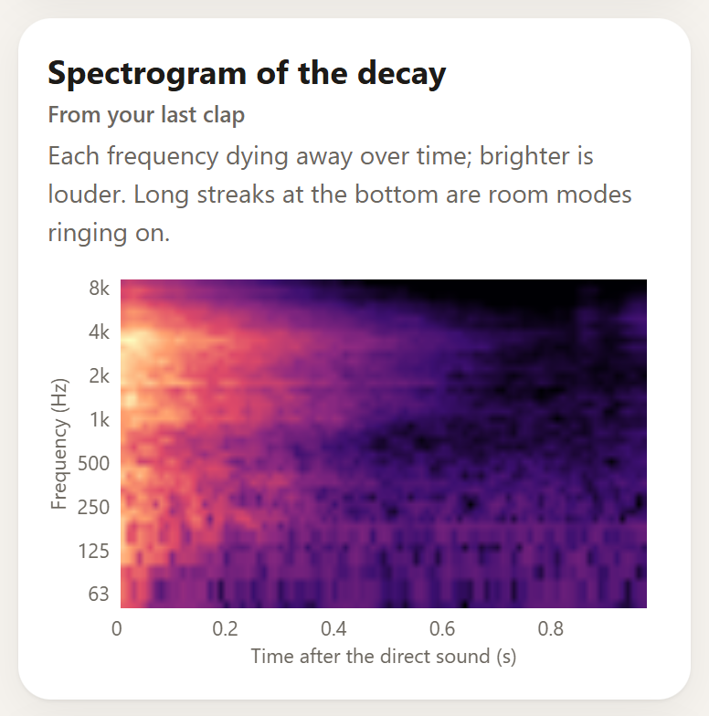

Each frequency dying away over time on a 1/6-octave axis from 50 Hz to
10 kHz, with 80 dB of range. Room modes show as long streaks at the bottom.
Anything that isn't the room shows too: in this real recording, a second
sound arrives at 0.7 s. In a sweep measurement, a knock during the sweep
shows as a descending streak, which is how to spot a spoiled measurement.

<br clear="right">

### Room modes

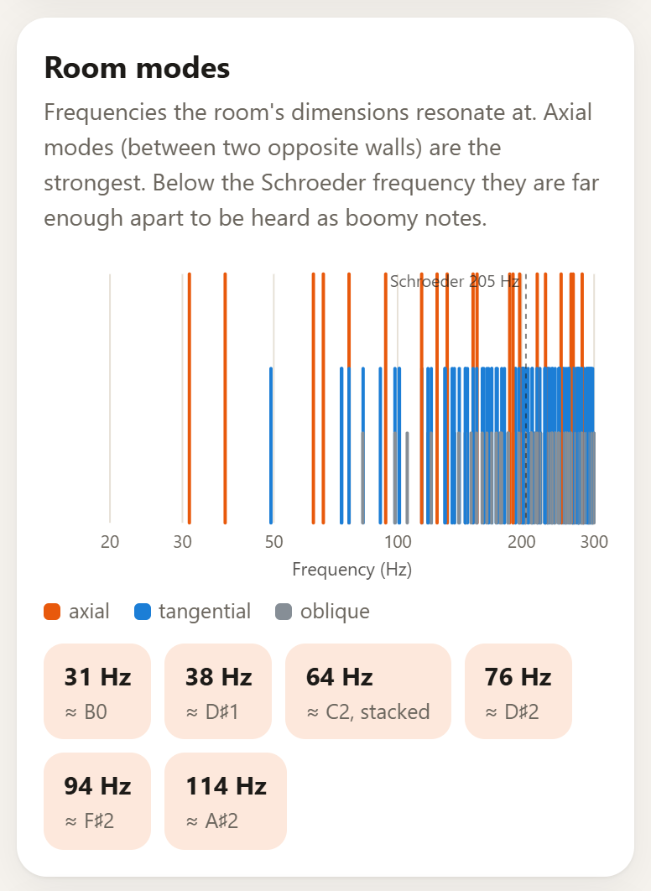

Every resonance of a rectangular room up to 300 Hz: axial (between two
opposite surfaces, the strongest), tangential and oblique, with the
Schroeder frequency marked. Below the chart are the axial modes under the
Schroeder frequency, grouped when they fall within 5 Hz of each other, with
their musical note. These are the notes that boom.

With a sweep, the measured response is drawn over the modes (*synthetic
room*, below), so peaks and dips can be matched to the resonances that cause
them.

<br clear="right">

<p>
  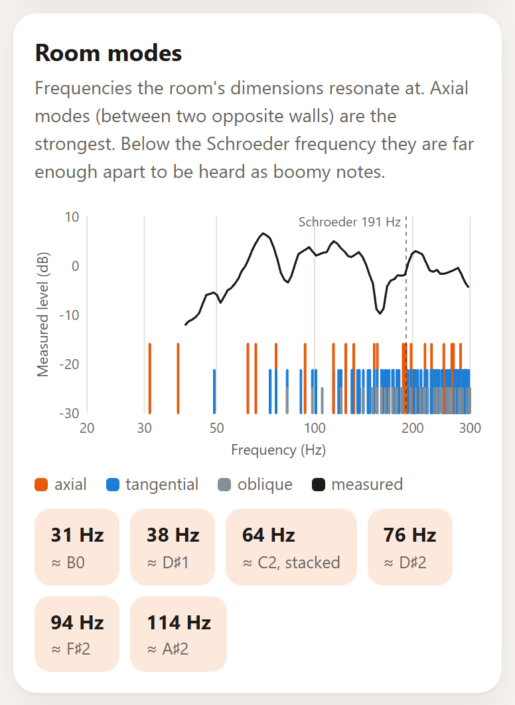
  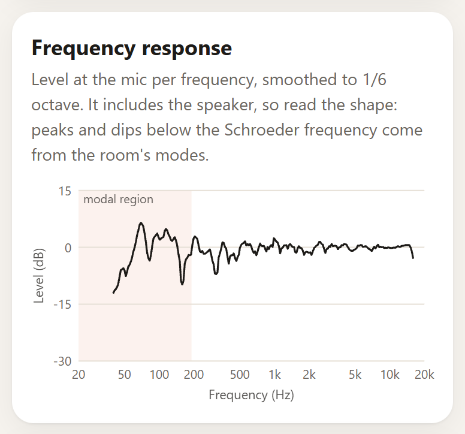
</p>

### Frequency response (sweep only)

The level at the microphone per frequency, from the first 0.5 s of the
impulse response, smoothed to 1/6 octave, with 0 dB at the 500 Hz–2 kHz mean
(*synthetic room*, above right). It includes the speaker and the phone's
microphone, so the useful reading is the shape in the shaded modal region,
not the absolute level.

### Maps of the room

<p>
  
  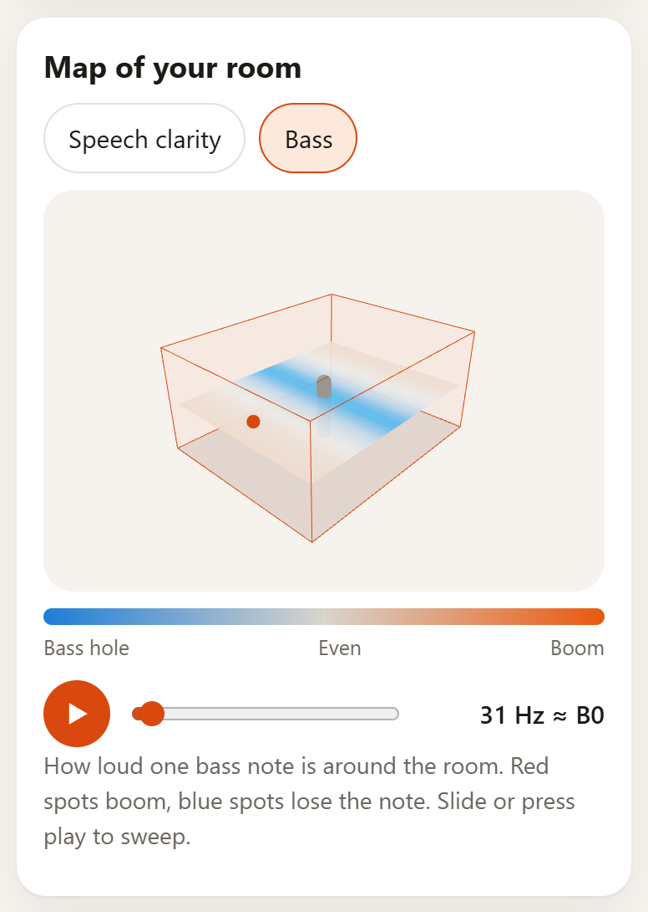
</p>

A 3D model of the room with a map on a plane at ear height (1.2 m):

- **Speech clarity:** an STI estimate for someone talking from the orange
  dot, from the measured RT per band and the distance to the talker.
- **Bass:** how loud one low note is at every point, from the modal sum of
  a rectangular room. The slider or the play button sweeps the frequency,
  so the pattern of booms and holes moves across the floor.

### All values (ISO 3382-1)

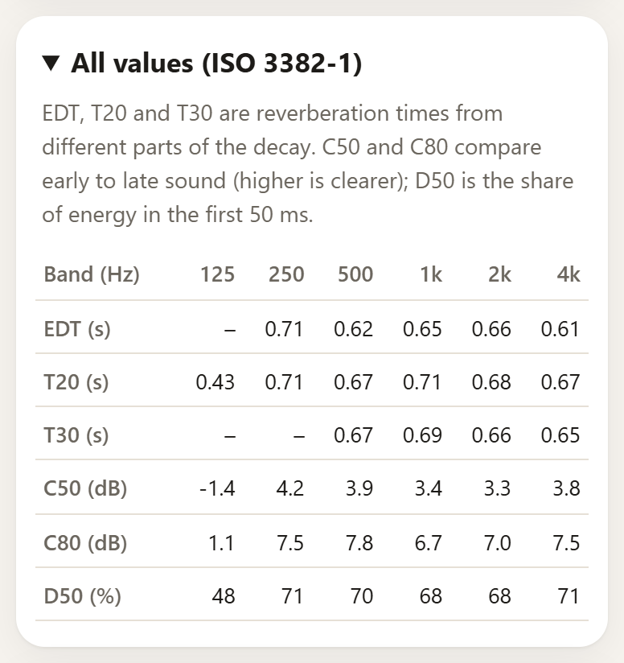

EDT, T20 and T30 (reverberation times from different parts of the decay),
C50 and C80 (early-to-late energy ratios, higher is clearer) and D50 (the
share of energy in the first 50 ms), per octave band, averaged over all
measurements. After a sweep there is also a button to download the impulse
response as a WAV file, to open in Room EQ Wizard or use in a convolution
reverb.

<br clear="right">

### Treatment plan

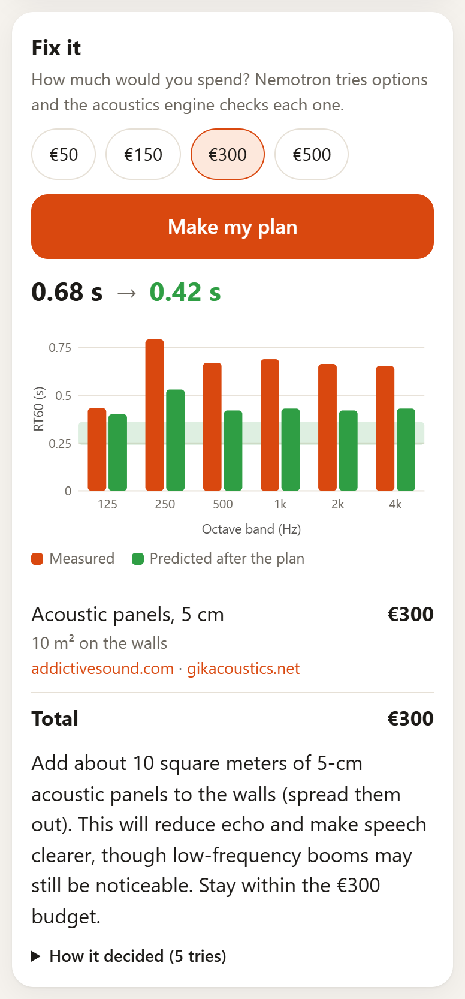

Pick a budget and Nemotron tries plans against a priced catalogue with tool
calls, while the acoustics engine validates and scores every one. The result
shows the RT60 per band before and after against the target, the items with
their cost, shop links found by Tavily, a short explanation, and "How it
decided": every plan Nemotron tried and what the engine said about it. A
room that is already too dry gets no plan, since everything in the catalogue
absorbs sound.

<br clear="right">

## How it works

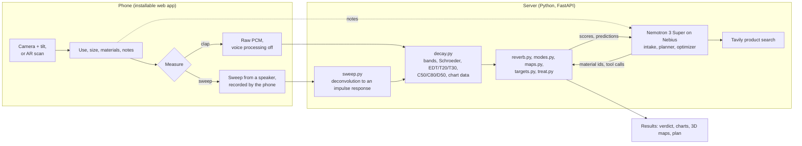

The server is stateless. `/api/clap` and `/api/sweep` return the per-band
results, and the app sends them back with every `/api/analyze` and
`/api/plan` request, which keeps it within a free serverless tier.

### The rule

**The models never produce an acoustic number.** Nemotron picks from the
materials table, decides whether another measurement is worth it, and calls
the engine with candidate plans. The engine computes every RT, clarity value
and prediction, and the measurements check the engine. Every agent has a
deterministic fallback, so the app still works if a model call fails.

### Measuring: clap or sweep

**Clap.** The app records 5 s from the microphone as raw PCM through an
AudioWorklet (no lossy codec), with the browser's echo cancellation, noise
suppression and gain control switched off, since they eat the reverberant
tail. It stores the settings the phone actually applied with every clap. A
quick on-device check says right away whether the clap was clear enough; the
analysis happens on the server.

**Test sweep.** An exponential sine sweep (Farina 2000), 6 s from 40 Hz to
16 kHz at −6 dBFS:

$$x(t) = \sin\left(2\pi f_1 L \left(e^{t/L} - 1\right)\right), \qquad L = \frac{T}{\ln(f_2/f_1)}$$

The recording is convolved with the inverse filter: the time-reversed sweep
with a 6 dB/octave tilt ($e^{-t/L}$) that undoes the sweep's pink spectrum.
The result is the room's impulse response. Harmonic distortion from a small
speaker lands before the linear response and is cut away, and the
deconvolution gains tens of dB of signal-to-noise over a clap.

The sweep is defined in continuous time, so the server rebuilds exactly the
signal the player produced at the recorder's sample rate, even when a laptop
plays at 44.1 kHz and the phone records at 48 kHz. Where the sweep starts in
the recording doesn't matter, because the deconvolution finds it. A recording
is rejected, with a message saying why, if the deconvolved peak isn't 30 dB
above the median (no sweep), if the sweep started before the recording, or
if less than 0.8 s of decay follows it.

The sweep has to come from a speaker away from the phone: a Bluetooth
speaker connected to the phone, or another device with
[`/speaker.html`](https://clapback-alpha.vercel.app/speaker.html) open. The
phone's own speaker sits next to its microphone, and at 1–2 cm the direct
sound is about 30 dB above the reverberant field, which hides the decay.

### From a recording to decay curves

`clapback/acoustics/decay.py` runs the same pipeline on a clap and on an
impulse response:

1. **Onset:** the rise into the loudest 10 ms frame. Taking the loudest
   event rather than the first loud one keeps talking or a knock before the
   clap from being analysed as the clap.
2. **Octave bands** from 125 Hz to 4 kHz: a 3rd-order Butterworth band-pass,
   applied forwards and backwards (zero phase).
3. **Noise floor:** where the decay meets the background, found by a
   simplified Lundeby iteration (fit the decay down to 10 dB above the noise,
   extrapolate to the noise level, re-estimate the noise after the
   crosspoint). The energy after the crosspoint is cut, and the energy the
   exponential tail would have carried is added back.
4. **Schroeder backward integration:**
   $E(t) = \int_t^{\infty} h^2(\tau)\, d\tau$, in dB relative to $E(0)$.
5. **Fits:** a straight line over part of the curve, extrapolated to −60 dB.
   Each fit is used only if the band has the dynamic range for it (the fit
   range plus a 10 dB margin, as ISO 3382-2 recommends), the line fits well
   ($r^2 \ge 0.95$) and the result is plausible for a room (0.05–5 s):

| Value | Fit range | Needs a peak-to-noise range of |
|---|---|---|
| EDT | 0 to −10 dB | 20 dB |
| T20 | −5 to −25 dB | 35 dB |
| T30 | −5 to −35 dB | 45 dB |

The RT reported per band is T30 if available, then T20, then EDT. With
several measurements, each value is averaged per band over the valid ones.

For the charts the same step returns the decay curve per band in 5 ms
steps, the broadband energy-time curve in 2 ms frames, and a spectrogram
(a Hann window of 2048 samples at 48 kHz, a 10 ms hop, averaged into
1/6-octave bands and sent as 0–255 levels over 80 dB).

### ISO 3382-1 values

With $t_0$ at the direct sound (the first sample within 20 dB of the peak,
as ISO 3382-1 defines it) and the decay curve normalised to the total
energy, the early/late ratios come straight from the curve:

$$C_{50} = 10 \lg \frac{\int_0^{50\,\mathrm{ms}} h^2\,dt}{\int_{50\,\mathrm{ms}}^{\infty} h^2\,dt}, \qquad
D_{50} = \frac{\int_0^{50\,\mathrm{ms}} h^2\,dt}{\int_0^{\infty} h^2\,dt}$$

C80 is C50 with 80 ms. They need 20 dB of range, and values beyond ±30 dB
(no tail, or no direct sound) are dropped.

### Room model and calibration

`reverb.py` predicts RT per band from the room: Sabine, or Eyring when the
mean absorption is high. It adds air absorption $m$ per band (from
ISO 9613-1, at about 20 °C and 50 % relative humidity) and a furnishing term
for the furniture, beds and clothes that the surfaces don't describe:

$$T_{\mathrm{Sabine}} = \frac{0.161\,V}{A + 4mV}, \quad A = \sum S_i\,\alpha_i \qquad\qquad
T_{\mathrm{Eyring}} = \frac{0.161\,V}{-S\ln(1-\bar\alpha) + 4mV}$$

Absorption coefficients come from `data/materials.json`: 21 materials with
typical published values from standard tables (the file names its sources
and says they are starting points). Free-text notes add patches of matching
materials through the intake agent. `calibrate` then compares the prediction
with the measurement per band and returns the factor the absorption must be
scaled by to match. The measurement always wins: plans start from the
measured absorption, not from the model.

### Room modes, maps and targets

**Modes** of a rectangular room, every combination up to 300 Hz, and the
**Schroeder frequency**, above which modes overlap into a diffuse field:

$$f_{n_x n_y n_z} = \frac{c}{2}\sqrt{\left(\frac{n_x}{L_x}\right)^2 + \left(\frac{n_y}{L_y}\right)^2 + \left(\frac{n_z}{L_z}\right)^2}, \qquad
f_S = 2000\sqrt{T/V}$$

**Maps** (`maps.py`), on a 0.25 m grid at 1.2 m:

- STI estimate: the modulation transfer of an exponential decay (Schroeder
  1981), mixed with the direct sound by the direct-to-reverberant ratio,
  then the IEC 60268-16 male weighting. It assumes no background noise, so
  it is an upper bound, and the app calls it an estimate.
- Bass: a modal sum for a rectangular room with a point source. The app runs
  the same formula in JavaScript so the frequency sweep can animate; the
  Python version is the tested reference.
- C50 from Barron's revised theory (Barron & Lee 1988), from the direct,
  early and late energy at distance $r$ for volume $V$ and RT $T$. It is in
  the API response but not drawn yet.

**Targets** for the mid-frequency RT, ±20 % (`targets.py`):

| Use | Target | Source |
|---|---|---|
| Studying or teaching | $\max(0.3,\ 0.32 \lg V - 0.17)$ s | DIN 18041, group A3 |
| Playing music | $0.45 \lg V + 0.07$ s | DIN 18041, group A1 |
| Mixing / studio | $0.25\,(V/100)^{1/3}$ s | EBU Tech 3276 |
| Podcast or calls | 0.30 s | common practice for voice rooms |
| Movies and TV | 0.35 s | common practice for home cinema |
| Just curious | 0.50 s | a comfortable furnished room |

### Treatment plans

`treat.py` decides whether a plan is allowed and what it would do. The
baseline is the **measured** absorption, so furniture the model doesn't know
about is already included:

$$A_{\mathrm{now}} = \frac{0.161\,V}{T_{\mathrm{measured}}} - 4mV, \qquad
\Delta A = \sum S_i\,(\alpha_{\mathrm{treatment}} - \alpha_{\mathrm{covered}}), \qquad
T_{\mathrm{new}} = \frac{0.161\,V}{A_{\mathrm{now}} + \Delta A + 4mV}$$

Validation checks each item's placement (a rug goes on the floor, curtains
over glass or on a wall), its area against what the room has (each item can
cover at most a set fraction of its surfaces, and curtains no more glass
than there is), and the total against the budget. The catalogue
(`data/treatments.json`) has rough planning prices: 5 cm panels at €30/m²,
10 cm panels at €50/m², heavy curtains at €25/m², a thick rug with underlay
at €30/m², and a filled bookshelf at €60/m².

### Measuring the room with the camera

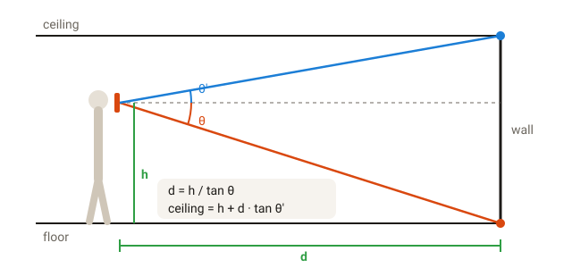

**Any phone** (`web/measure.js`): hold the phone in front of your eyes and
put the cross in the middle of the camera view on the line where a wall
meets the floor. The accelerometer gives the camera's angle below the
horizon, θ. With the phone's height $h$ (your height minus about 15 cm),
that wall is $d = h/\tan\theta$ away, and the ceiling line of the same wall
gives the height. Five taps (the front wall's floor and ceiling lines, then
the back, left and right walls) give length, width and height. The cross
turns green when the phone is steady, and if furniture hides a wall's floor
line, its ceiling line works too. Three centimetres of error in $h$ is 2 %
on every distance, and facing a wall 10° off square adds 1.5 %.

**AR scan** (`web/scan.js`, Chrome on ARCore phones): WebXR hit-testing
finds the floor. You tap each corner, and any room shape works; a nearly
rectangular outline snaps to a rectangle so modes and maps apply. For the
height, you aim at the ceiling right above a marked corner. Hit-testing
can't find ceilings, but the corner's vertical line is known, so the height
is where the view ray passes over it.

## NVIDIA Nemotron on Nebius Token Factory

All model calls go through Nebius Token Factory's OpenAI-compatible API
(`clapback/llm/nemotron.py`), using **NVIDIA Nemotron 3 Super**
(`nvidia/nemotron-3-super-120b-a12b`).

| Agent | What Nemotron does | How it's kept honest | Code |
|---|---|---|---|
| Intake | Turns the user's own words into material ids and areas | Only ids from `data/materials.json`; unknown ids dropped and shown back as "not counted"; areas clamped to the room | `agents/intake.py` |
| Planner | After each measurement, decides whether another is worth it and says where to stand | Hard limits in code: at least 2 claps, at most 4; a sweep ends it | `agents/planner.py` |
| Optimizer | Tool-calling loop with `try_plan` and `finish`, against a priced catalogue and a budget | Every plan validated and scored by `acoustics/treat.py`; forced `finish` on the last turn; greedy fallback; no call at all when the room is already too dry | `agents/optimizer.py` |
| Products | Tavily, not a model: one web search per treatment type for shop links | Only https results; cached; off without a key | `products.py` |

What shaped the design:

- Reasoning is switched off for these calls
  (`chat_template_kwargs: {enable_thinking: false}`), which brings each call
  under about 2 s. With reasoning on, a small `max_tokens` can be spent
  before any answer arrives.
- Nemotron 3 Nano was tried first for intake. It mapped "a closed wardrobe"
  to 6 m² of carpet, while Super flags it as unknown, so every agent uses
  Super.
- A full session (3 claps with notes, then a plan) measured **9 Super calls,
  about 10.4k input and 1k output tokens, about 15 s in total**. At Token
  Factory's per-token prices that is well under a cent per room.
- A public demo means anyone can spend the credits, so each server instance
  allows 40 model-backed requests per client IP per hour
  (`CLAPBACK_LLM_PER_HOUR`).

## Accuracy and tests

`pytest` runs 54 tests: the engine on synthetic signals with known answers,
the agents with the model faked, and the API.

| What | Result |
|---|---|
| T20 from a synthetic decay, RT 0.3 / 0.6 / 1.2 s, bands from 1 kHz up | within 10 % |
| Noise floor at −40 dB | T30 dropped, T20 within 10 % |
| C50 and C80 against the exact values for an exponential decay | within 1 dB (the JND for C80) |
| D50 | within 0.05 |
| Sweep through a synthetic room, RT 0.4 / 0.9 s, 500 Hz–2 kHz | T30 within 10 % |
| Sweep played at 44.1 kHz, recorded at 48 kHz | RT within 10 % |
| Frequency response of a bare delta | flat within ±1 dB, 100 Hz–10 kHz |
| Loud talking one second before the clap | onset still on the clap, RT within 10 % |
| No sweep in the recording, or a sweep cut off | rejected with a message |

On a real phone, two claps in the same room give mid-frequency RTs of 0.67
and 0.69 s (3 % apart), with the phone applying no voice processing. The
whole app, driven with a fake microphone playing a sweep through a
synthetic 0.70 s room, measures 0.75 s.

Not done yet: a comparison against a reference instrument (a measurement
microphone with Room EQ Wizard, or a room with a certified RT). The impulse
response download exists partly for that cross-check.

## Limits

- One clap is a rough measurement below 250 Hz. The app asks for more
  claps and draws low bands faded; the sweep fixes it.
- Statistical acoustics assumes a diffuse field. Bass maps use the modal
  model instead, and only for rectangular rooms.
- The STI map is an estimate from theory for a quiet room, not an
  IEC 60268-16 measurement. The C50 in the figures and the ISO table is
  measured.
- Absorption coefficients and treatment prices are typical values for
  planning, listed in `data/`.
- Phone microphones differ, and their low end rolls off. The frequency
  response includes the speaker and the microphone.
- Android may switch a Bluetooth speaker connected to the phone to call mode
  while the microphone is open (low sample rate). The app detects it and
  suggests using another device as the speaker.

## Using the live app

Open https://clapback-alpha.vercel.app on a phone. The microphone and the
camera need HTTPS, which the live app has. In Chrome, "Install app" puts it
on the home screen, full screen.

- **Clap:** stand near the middle of the room, phone at chest height and an
  arm's length away, everyone quiet for 5 seconds. Two or more claps from
  different spots are better than one.
- **Sweep:** put a speaker at least 2 m away at ear height, volume at about
  three quarters. Either connect it to the phone by Bluetooth, or open
  `https://clapback-alpha.vercel.app/speaker.html` on a laptop or second
  phone, tap *Tap to measure* on the phone, then press *Play* on the other
  device within 4 seconds.
- **Camera measuring:** tap *Measure it with the camera*, enter your height
  once, and follow the five steps.

## Running it yourself

Requires Python 3.11 or newer.

```bash
git clone https://github.com/lluisestape-upc/Clapback.git
cd Clapback
python -m venv .venv
.venv\Scripts\activate          # Windows; on macOS/Linux: source .venv/bin/activate
pip install -e ".[dev]"
copy .env.example .env          # macOS/Linux: cp .env.example .env
python scripts/check_nebius.py  # lists the NVIDIA models the key can use, makes one short call
uvicorn clapback.server:app --port 8766 --reload
pytest
```

Then open http://localhost:8766. The microphone works on `localhost`. To use
a phone, forward the port over USB (Chrome → `chrome://inspect` → Port
forwarding) and open `http://localhost:8766` on the phone, or put the server
behind HTTPS.

Environment variables (`.env`):

| Variable | Needed | What for |
|---|---|---|
| `NEBIUS_API_KEY` | for the agents | Nemotron on Nebius Token Factory; without it every agent uses its fallback |
| `NEBIUS_BASE_URL` | no | defaults to `https://api.tokenfactory.nebius.com/v1` |
| `TAVILY_API_KEY` | no | shop links in the plan |
| `CLAPBACK_LLM_PER_HOUR` | no | model-backed requests per IP per hour, default 40 |
| `CLAPBACK_RECORDINGS` | no | where recordings are saved with their context (default `recordings/`, `/tmp/recordings` on Vercel) |

**Deploying for free on Vercel.** `pyproject.toml` declares the FastAPI
entrypoint (`[tool.vercel]`), and the web app is served as static files from
the CDN. With the [Vercel CLI](https://vercel.com/docs/cli):

```bash
vercel link
vercel env add NEBIUS_API_KEY production
vercel env add TAVILY_API_KEY production
vercel deploy --prod
```

## API

| Endpoint | Input | Output |
|---|---|---|
| `POST /api/clap` | multipart: `audio` (WAV), `room` (JSON), `goal`, `notes`, `mic` (applied settings) | per-band EDT/T20/T30/C50/C80/D50, decay curves, energy-time curve, spectrogram, and the report for this clap |
| `POST /api/sweep` | as above, plus `f1`, `f2`, `seconds` | as above, plus the frequency response, the impulse response as a base64 WAV, and where the sweep was found; 422 with a reason if there's no whole sweep |
| `POST /api/analyze` | JSON: `room`, `goal`, `notes`, `claps` (per-band results of each measurement), `kinds` | averaged bands, verdict and target, modes, maps, what the notes added (Nemotron), and whether to measure again (Nemotron) |
| `POST /api/plan` | as `/api/analyze`, plus `budget_eur` | treatments with cost and shop links, RT per band before and after, summary, and the trace of tried plans |
| `POST /api/room` | a room | volume and areas, or 422 for an unknown material |
| `GET /api/materials` | | the materials table |
| `GET /api/health` | | `{"ok": true}` |

A room is a floor polygon in metres, a height, and surfaces (floor, ceiling,
one per wall), each with a material id and optional patches; see
`clapback/room.py`.

## Project layout

```
clapback/
  server.py      FastAPI app: the API, plus the web app as static files
  room.py        room model (floor polygon, height, surfaces, patches)
  materials.py   absorption table loader
  targets.py     target RT per use and the verdict
  products.py    Tavily product search
  acoustics/
    decay.py     onset, bands, noise floor, Schroeder, EDT/T20/T30, C50/C80/D50, chart data
    sweep.py     exponential sine sweep, deconvolution, frequency response, IR export
    reverb.py    Sabine/Eyring, air, furnishing, calibration
    modes.py     room modes, Schroeder frequency, boomy notes
    maps.py      STI estimate, modal pressure, C50 (Barron)
    treat.py     treatment validation, cost and prediction, greedy plan
  agents/        intake, planner, optimizer (Nemotron)
  llm/           Nebius Token Factory client
web/             the app, no build step
  app.js         flow and results
  capture.js     microphone to WAV, quick quality check
  sweep.js       the test sweep (the same signal as sweep.py)
  charts.js      SVG and canvas charts
  measure.js     camera + tilt room measuring
  scan.js        WebXR AR scan
  room3d.js      3D room and maps (three.js)
  speaker.html   plays the sweep on a second device
data/            materials.json, treatments.json
tests/           pytest: engine, sweep, agents with the model faked, API
docs/            PLAN.md, images/
scripts/         check_nebius.py
```

## References

- M. R. Schroeder, "New method of measuring reverberation time", *JASA* 37, 1965.
- A. Lundeby, T. E. Vigran, H. Bietz, M. Vorländer, "Uncertainties of measurements in room acoustics", *Acustica* 81, 1995.
- A. Farina, "Simultaneous measurement of impulse response and distortion with a swept-sine technique", AES 108th Convention, 2000.
- M. Barron, L.-J. Lee, "Energy relations in concert auditoriums, I", *JASA* 84, 1988.
- M. R. Schroeder, "Modulation transfer functions: definition and measurement", *Acustica* 49, 1981.
- ISO 3382-1:2009 and ISO 3382-2:2008, measurement of room acoustic parameters.
- IEC 60268-16, objective rating of speech intelligibility by speech transmission index.
- ISO 9613-1:1993, attenuation of sound during propagation outdoors, part 1: absorption by the atmosphere.
- DIN 18041:2016, acoustic quality in rooms.
- EBU Tech 3276, listening conditions for the assessment of sound programme material.

## License

MIT, see [LICENSE](LICENSE).
